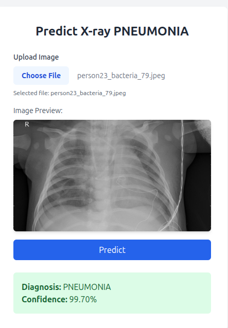

# Penumina - AI-Powered Pneumonia Detection

A **Vision Transformer (ViT)** based web application for pneumonia detection from chest X-ray images, now powered by **FastAPI**.

---

## 🚀 Quick Start

### 1. Clone Repository

    git clone https://github.com/your-username/penumina.git
    cd penumina

### 2. Environment Setup

#### Create Virtual Environment

    # Using venv
    python -m venv penumina_env
    source penumina_env/bin/activate  # On Windows: penumina_env\\Scripts\\activate

    # Or using conda
    conda create -n penumina_env python=3.9
    conda activate penumina_env

#### Install Dependencies

    pip install -r requirements.txt

### 3. Download Pre-trained Models

📁 Download Models from Google Drive: https://drive.google.com/your-drive-link-here

After downloading:
1. Extract the ZIP file
2. Place the extracted files into the `models/` directory

Expected structure:

    penumina/
    ├── models/
    │   ├── config.json
    │   ├── pytorch_model.bin
    │   └── preprocessor_config.json

### 4. Run the Application (FastAPI + Uvicorn)

    uvicorn app:app --host 0.0.0.0 --port 5000 --reload

Visit `http://localhost:5000` in your browser to access the web interface.

---

## 📁 Project Structure

    penumina/
    ├── app.py                  # FastAPI web application
    ├── vit.py                  # Vision Transformer prediction logic
    ├── train_vit.ipynb         # Model training notebook
    ├── requirements.txt        # Python dependencies
    ├── preview.png             # Application preview
    ├── models/                 # Pre-trained model files
    ├── data_new/               # Training/testing datasets
    ├── static/                 # Static assets (uploads, CSS, JS)
    ├── templates/              # HTML templates (Jinja2)
    └── __pycache__/            # Python cache files

---

## 🔧 Usage

### Web Interface

1. Start the FastAPI app using Uvicorn
2. Open your browser at `http://localhost:5000`
3. Upload a chest X-ray image
4. Click "Predict" to get diagnosis
5. View the result with confidence score

### Programmatic Usage

    from vit import predict_image
    from transformers import ViTForImageClassification, ViTImageProcessor
    import torch

    model = ViTForImageClassification.from_pretrained('models')
    processor = ViTImageProcessor.from_pretrained('models')
    device = 'cuda' if torch.cuda.is_available() else 'cpu'
    model.to(device)

    with open('path/to/xray.jpg', 'rb') as img_file:
        result = predict_image(model, processor, img_file, device)
        print(f"Diagnosis: {result['Diagnosis']}")
        print(f"Confidence: {result['confidence']}")

---

## 🧠 Model Details

- Architecture: Vision Transformer (ViT)
- Frameworks: PyTorch + HuggingFace Transformers
- Input: Chest X-ray image (RGB)
- Output: Binary classification – Normal / Pneumonia
- Training: Fine-tuned on medical imaging datasets

---

## 📋 Requirements

- Python 3.7+
- FastAPI
- Uvicorn
- CUDA-compatible GPU (recommended)

---

## 🔬 Model Training

To retrain or fine-tune the model:

1. Open `train_vit.ipynb` in Jupyter Notebook
2. Ensure your dataset is inside the `data_new/` directory
3. Follow the notebook cells for training
4. Save the final model to the `models/` folder

---

## 🤝 Contributing

1. Fork this repo
2. Create a branch: `git checkout -b feature/your-feature`
3. Commit changes: `git commit -m "Add feature"`
4. Push: `git push origin feature/your-feature`
5. Open a Pull Request

---

## 📝 License

MIT License — see `LICENSE` file.

---

## ⚠️ Disclaimer

This application is for **research and educational purposes only**. It is **not** intended for clinical or medical use. Always consult qualified medical professionals for diagnosis or treatment decisions.

---

## 📞 Support

- GitHub Issues: https://github.com/your-username/penumina/issues
- Check notebooks and source code for documentation

---

**Made with ❤️ to empower AI in healthcare**

